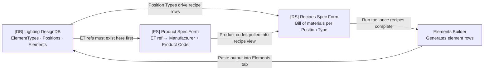
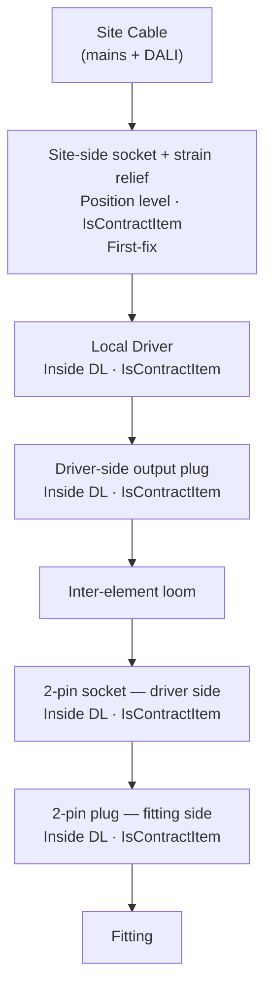
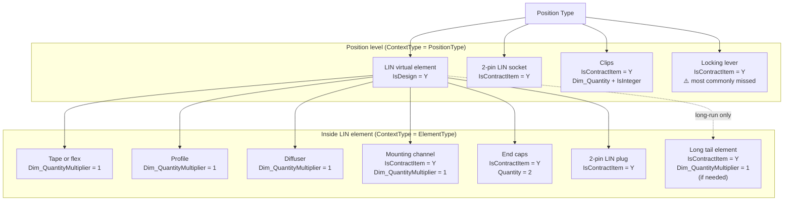

# Product Spec & Recipes

Process Guide

---

## Schema Reference Key

Throughout this guide, references to specific Excel files and their sheets are highlighted as follows:

| **Tag** | **Refers To**     | **File**                                                     |
| ------- | ----------------- | ------------------------------------------------------------ |
| \[PS\]  | Product Spec Form | SCHEMA_Product_SpecForm_V3.xlsx - Sheet: Form                |
| \[RS\]  | Recipes Spec Form | SCHEMA_Recipes_SpecForm_V1.xlsx - Sheet: Form                |
| \[DB\]  | Lighting DesignDB | The main DesignDB Excel (ElementTypes, Positions, etc. tabs) |

---

1. Overview

The Product Spec and Recipes process bridges the lighting design intent (captured in the Lighting DesignDB) with the real-world procurement and manufacture of components. It answers two questions for every position type in the design:

- What physical products need to be ordered or made? → Product Spec
- How do those products combine to build the position? → Recipes

The three files always work together:

| Excel File        | Tag    | Purpose                                                                              |
| ----------------- | ------ | ------------------------------------------------------------------------------------ |
| Lighting DesignDB | \[DB\] | **Master design database** — Locations, Positions, Elements, ElementTypes, LinksMap  |
| Product Spec Form | \[PS\] | Maps each element type to a real manufacturer product code                           |
| Recipes Spec Form | \[RS\] | Defines the bill of materials (ingredients) for each position type (and ElementType) |

Only create product specs and recipes for achievable (real, non-parent) position types that are confirmed to be used in the design. Run the Form Template vs Positions tool first to verify which position types are active.

*Why is it done like this?* Projects are big and can have thousands of Positions in them. Using a recipe allows contents to be consistently created, quoted, and ordered.

---

2. Prerequisites Before Starting

Check all of the following before creating any entries:

- The Form Template is open and sorted A→Z by product code — this helps identify which Position Types share product codes and allows recipe elements to be reused.
- Run the Form Template vs Positions tool to confirm which position types still exist in the design before doing any work.
- Confirm any product accessories are included in the product code (seen commonly with LightGraphix/Orluna/Phos).
- Feeds and FF&E **supplied by other companies** do not need product specs or recipes.
- Do not recipe or cable parent position types — only achievable (real) position types.
- ElementTypes exist in the ElementTypes tab — elements will not appear in the element builder tool without them.

### TBC Checks

- Any position type with a TBC flag must transfer that flag to the corresponding element types.
- Record the reason for TBC in the ElementType's notes — unless it is a feed or similar that will always be TBC.
- Always verify whether a TBC flag is still warranted — it may have been agreed and the flag accidentally left on.
- Per-element linear dimensions should be marked TBC until physical dimensions are confirmed.
- Mark elements as IsPropertiesTBC unless the finish has been approved on the Form Template.

---

3. Product Spec Form

File: **SCHEMA_Product_SpecForm_V3.xlsx**

The Product Spec form maps every element type used in the design to a real-world purchasable product. It is the source of truth for what gets ordered. Each row represents one element type.

### 3.1 Columns in the Product Spec Form

| **Column**           | **Description**                                                                                                                                              |
| -------------------- | ------------------------------------------------------------------------------------------------------------------------------------------------------------ |
| IsDeleted            | Mark Y to soft-delete a row. Leave blank otherwise.                                                                                                          |
| EntityType           | The type of entity — typically ElementType.                                                                                                                  |
| EntityRef            | The Ref of the element type being specified. Must match \[DB\] ElementTypes exactly.                                                                         |
| Manufacturer         | The company supplying or manufacturing the component.                                                                                                        |
| ProductCode          | The manufacturer's product code. Use N/A for items manufactured by Ideaworks (e.g. DL, LIN). Must be unique — conditional formatting flags duplicates.       |
| CutPoint             | For tape and encapsulated linear: the interval at which the tape can be cut. Also enter this in \[DB\] ElementTypes.CutPoint.                                |
| ComponentDescription | Human-readable description of the component being purchased.                                                                                                 |
| InternalNotesText    | Internal notes not visible externally.                                                                                                                       |
| ExternalNotesText    | Notes visible to external stakeholders.                                                                                                                      |
| ComponentID          | Internal component identifier.                                                                                                                               |
| CustomisationText    | Text used on the customisation form for this component.                                                                                                      |
| ExplodeDescription   | Description used in exploded/expanded entity views. For LIN elements: record cable entry type and tail length here (e.g. "End cable entry, 500mm tail length"). |
| ProductDescription   | Full product description from the manufacturer.                                                                                                              |
| IsTBC                | Y if the product selection is provisional / to be confirmed.                                                                                                 |
| IsPropertiesTBC      | Y if the product is identified but specific properties (finish, colour, etc.) are unconfirmed.                                                               |

### 3.2 Key Rules

- Every element type needs a row — including **DL** and **LIN** virtual elements manufactured by Ideaworks. These get ProductCode = "N/A".
- For encapsulated linear, set the Manufacturer to the actual tape or encapsulation supplier, not Ideaworks.
- For tape and encapsulated linear: enter the CutPoint in both this form and in \[DB\] ElementTypes.CutPoint.
- To find obscure product codes (plaster-in frames, clips, etc.) use Tracecodes: search by manufacturer, then narrow by product keyword.
- The ProductCode column has conditional formatting for duplicates — there must only be one element type per product.
- Where a manufacturer supplies multiple variants with near-identical codes (e.g. legacy vs new light engine, different cable entry directions), use ComponentDescription or ExplodeDescription to distinguish them rather than creating duplicate ProductCode entries.

---

4. Element Types (DB)

Element Types are defined in the Lighting DesignDB and must exist before recipes can be built. They are not directly part of the Product Spec or Recipes Excel files but are closely linked to both.

### 4.1 Naming Convention

Element type refs follow the pattern:

**`ET-`** + *what it is* + *family* + *variant suffix*

Each segment is determined as follows:

**What it is** describes the physical component category. Use short, consistent uppercase refs. Common categories include:

| **Token**        | **Meaning**                                                            |
| ---------------- | ---------------------------------------------------------------------- |
| DL               | Downlight virtual element (Ideaworks-assembled)                        |
| LIN              | Linear virtual element (Ideaworks-assembled)                           |
| PS               | Point source fitting (trimless or remote)                              |
| TAPE             | LED tape substrate                                                     |
| FLEX             | Encapsulated flexible LED product                                      |
| PROFILE          | Aluminium extrusion profile                                            |
| DIFF             | Diffuser for profile                                                   |
| CAP              | End caps for profile or encapsulated linear                            |
| CLIP             | Mounting clips for profile or encapsulated linear                      |
| MOUNT            | Mounting channel or bracket (e.g. for flex products without a profile) |
| DRIVER           | Standalone LED driver                                                  |
| CCR / CCL        | Remote or local constant-current driver module                         |
| CVR              | Constant-voltage remote driver / power supply                          |
| PANEL            | Driver panel virtual element                                           |
| ENCLOSURE        | Physical panel enclosure body                                          |
| GLAND            | Cable gland                                                            |
| SLEEVE           | Cable or connector sleeve                                              |
| Connector types  | Named by pin count and side: see §6.1                                  |

**Family** identifies the product line or profile series the element belongs to (e.g. the profile width/height code, the flex product family name, the driver output rating). This segment comes directly from the manufacturer's naming.

**Variant suffix** is `-01`, `-02`, etc. and is added only when multiple variants of the same component exist within the same family (e.g. IP20 vs IP54 of the same tape, two different beam angles of the same fitting, legacy vs new light engine).

Examples of how these rules compose (illustrative — actual refs are project-specific):

| **Ref pattern**                      | **How it is built**                                              |
| ------------------------------------ | ---------------------------------------------------------------- |
| `ET-LIN-TAPE-[ProductFamily]-01`     | LIN tape, named family, first variant                            |
| `ET-LIN-PROFILE-[ProductFamily]-01`  | Profile extrusion, named family                                  |
| `ET-LIN-DIFF-[ProductFamily]-01`     | Diffuser matching that profile family                            |
| `ET-LIN-CAP-[ProductFamily]-01`      | End caps for that profile family                                 |
| `ET-LIN-CLIP-[ProductFamily]-01`     | Clips for that profile family                                    |
| `ET-LIN-FLEX-[ProductFamily]-01`     | Encapsulated flex product from named family                      |
| `ET-LIN-MOUNT-[ProductFamily]-01`    | Mounting channel for a flex product that requires one            |
| `ET-DL-01`, `ET-DL-02`              | Downlight virtual elements; numbered sequentially across project |
| `ET-PS-[Finish]-[Beam]`             | Point source fitting; finish and beam angle encode customisation |
| `ET-CCL-D-[mA]-[CH]-01`            | Local CC driver; output in mA, number of channels, variant       |

The `[ProductFamily]` syntax may not be used on smaller projects.

> **All refs are project-specific.** The naming convention above defines the structure; the actual refs used will depend on the products selected for that project.

### 4.2 Position Type Prefix Convention

Position type refs are project-defined. At the start of a project, a prefix convention is established so that the ref encodes the category of position at a glance. The specific prefixes used will vary between projects. The convention should be documented in the project brief or Form Template.

When working with an existing project, examine the existing position type refs and the Sheet3 tab of the Recipes workbook (which lists any special groupings such as remote-driver positions) to understand the convention in use.

Common things the prefix convention typically encodes:

- Whether the position is a downlight, linear, point source, track fitting, or FF&E
- Whether the fitting is local-driver or remote-driver (CC)
- Whether the position is interior or exterior / IP-rated
- Whether the linear is architectural (cove/coffer) or joinery (shelf/vanity)

### 4.3 Tail Length Convention for Linear

The tail length recorded in the ExplodeDescription of the ET-LIN element type is determined by the installation context. The project convention should be established up front and applied consistently.

| **Context**                         | **Tail Length**                              | **Rationale**                                                                         |
| ----------------------------------- | -------------------------------------------- | ------------------------------------------------------------------------------------- |
| Architectural (cove, coffer, niche) | Shorter (e.g. 500 mm)                        | Driven by recess depth; cable travels a short distance to a nearby connection point   |
| Joinery (shelf, vanity, cabinet)    | Longer (e.g. 3000 mm)                        | Cable must reach a remote connection point behind the joinery                         |
| Long external or concealed run      | Much longer, or use intermediate tail element | Encapsulated linear in deep structure or external positions with a remote junction box |

Record the tail length and cable entry type (end entry, rear entry, side entry) in the ExplodeDescription column. The format is:

> *"[Entry type], [tail length]mm tail length"*
> e.g. "End cable entry, 500mm tail length"

Where the installation requires a cable run beyond what the linear manufacturer can supply as a tail, create an intermediate tail element type (Manufacturer = Ideaworks, ProductCode = N/A) and include it inside the LIN element with Dim_QuantityMultiplier = 1.

### 4.4 Collections

- Add collections for linear components from the style guide.
- The Name and Description fields on element types are for human readability only — they do not need to be strict.

---

5. Recipes

File: **SCHEMA_Recipes_SpecForm_V1.xlsx**

A recipe defines the bill of materials for a position type — what elements (ingredients) are needed to build one instance of it. Each row is one ingredient within a recipe.

### 5.1 Columns in the Recipes Spec Form

| **Column**             | **Description**                                                                                                                                        |
| ---------------------- | ------------------------------------------------------------------------------------------------------------------------------------------------------ |
| ContextType            | The type of entity the recipe belongs to — typically PositionType or ElementType.                                                                      |
| ContextRef             | The Ref of the position type or element type this recipe row belongs to. Must match \[DB\] PositionTypes or ElementTypes.                              |
| RecipeIndex            | Ordering index within the recipe. Index 1 at position level is always the IsDesign element.                                                            |
| EntityType             | The type of the ingredient entity — typically ElementType.                                                                                             |
| EntityRef              | The Ref of the element type ingredient. Must match \[DB\] ElementTypes.                                                                                |
| Sort Order             | Controls the display order of ingredients on the customisation form. Keep consistent across all position types.                                         |
| RefSuffix              | Optional suffix appended to element refs when generated.                                                                                               |
| Name                   | Human-readable name for the ingredient in this recipe context.                                                                                         |
| Description            | Short description of the ingredient.                                                                                                                   |
| Details                | Extended detail. For enclosure recipes: use slot labels to identify driver positions (e.g. `<1>`, `<2>`, `<A>`, `<B>`).                               |
| Quantity               | Fixed quantity per position (e.g. 2 for caps, 4 for enclosure feet). Independent of dimension.                                                         |
| PackQuantity           | Pack size for procurement purposes.                                                                                                                    |
| IsDeleted              | Y to soft-delete this recipe row.                                                                                                                      |
| IsDesign               | Y for the single top-level element representing the position in the Elements tab. No outer wrapper. Only one per position type (e.g. the DL or LIN).   |
| IsContractItem         | Y for smaller procurement components. These appear in System Explorer expanded entities but not in the Elements tab.                                   |
| IsTRItem               | Y if this is a track/rail item.                                                                                                                        |
| Dim_QuantityMultiplier | Set to 1 for tape, profile, diffuser, and mounting channel so the physical measurement factors into quantities.                                         |
| Dim_Quantity           | For clips: the clips-per-metre value for this product. Confirm with manufacturer. Combine with IsInteger = Y.                                          |
| IsInteger              | Y for clips, so quantity rounds down to a whole number. Used with Dim_Quantity.                                                                        |

### 5.2 IsDesign vs IsContractItem

This distinction controls where elements appear in the system and is critical to get right:

| **Flag**           | **Meaning**                                                                           | **Appears in Elements Tab?**                          | **Example**                          |
| ------------------ | ------------------------------------------------------------------------------------- | ----------------------------------------------------- | ------------------------------------ |
| IsDesign = Y       | Top-level element representing the position. One per position type. No outer wrapper. | Yes                                                   | DL, PS, LIN                          |
| IsContractItem = Y | Smaller procurement components with an outer wrapper.                                 | No (but visible in System Explorer expanded entities) | Connectors, end caps, clips, drivers |

### 5.3 Quantity Rules — Critical

Incorrect quantity settings are the most common source of ordering errors:

| **Component**                             | **Column to Use**            | **Value**                        | **Effect**                                                                                                         |
| ----------------------------------------- | ---------------------------- | -------------------------------- | ------------------------------------------------------------------------------------------------------------------ |
| Tape, profile, diffuser, mounting channel | Dim_QuantityMultiplier       | 1                                | Multiplies quantity by the measured dimension. Without this, 1 unit is ordered per position regardless of length.  |
| End caps                                  | Quantity                     | 2                                | Always 2 per linear regardless of length.                                                                          |
| Fixed-count components (feet, glands)     | Quantity                     | As specified                     | Set the exact count required per position or enclosure.                                                            |
| Clips                                     | Dim_Quantity + IsInteger = Y | Clips-per-metre for this product | Rounds down to whole metres. Confirm spacing with manufacturer — it is not always 5 per metre.                     |

⚠️ If Dim_QuantityMultiplier is not set to 1 for tape/profile/diffuser/mounting channel, the system will order one full unit for every child position regardless of actual length. This is a critical error.

⚠️ Clip spacing varies between product families. Do not assume 5 clips per metre without confirming against the manufacturer's installation guidance.

### 5.4 First-Fix Components

Some components must be contextualised **directly into the position type** — NOT packaged inside a DL element. This allows them to be sent to site for first-fix installation, which happens long before the rest of the downlight is installed.

First-fix components typically include:

- **Site-side mains/DALI connector** — the socket that the electrician wires the incoming cable into
- **Site-side strain relief** — the cable restraint that locks onto the site-side connector
- **Mounting collar or frame** — if required for the fitting type, so the plasterer or carpenter can finish around it

The specific element types used for each of these will vary by project. What matters is that all components needed before the fitting arrives on site are contextualised at position level, not buried inside the DL element.

For junction box position types, the first-fix kit typically consists of a small number of lever connectors and their housings, with a fixed Quantity per position.

### 5.5 What Does Not Need Reciping

- Accessories included with a fitting from the manufacturer (glare shields, honeycomb, etc.)
- Parent position types — only recipe achievable (real, non-parent) position types
- Cable runs and track — send drawings to the manufacturer for quoting instead
- Position types that have been removed from the design

---

6. Connectors

### 6.1 Connector Naming Convention

Connector element types are named using the pattern:

**`ET-`** + *pin count* + **`Pin`** + *side/type* + *variant suffix*

The **side/type** segment distinguishes connectors that share a pin count but serve different layers of the wiring system:

| **Side/Type token** | **Meaning**                                                                                 |
| ------------------- | ------------------------------------------------------------------------------------------- |
| (none / `-Local`)   | Standard site-side connector (mains/DALI, e.g. 5-pin for a full local-driver position)     |
| (none / `-Local`)   | Standard site-side connector (mains/DALI, e.g. 2-pin + 3-pin for a full local-driver position)     |
| `-LIN`              | Linear connector — between the PSU and the LIN element                                      |
| `-Remote`           | Remote-driver connector — between a remote CC driver and the fitting (2-pin, low voltage)   |
| `-IP`               | IP-rated connector — for exterior or wet-area positions requiring an ingress-protected type  |
| `-Custom`           | Manufacturer-supplied custom connector (e.g. provided pre-wired with the fitting)           |
| `-SR`               | Strain relief — locks onto a connector body to secure the cable                             |

A **plug** carries the male pins (fitting or driver end); a **socket** carries the female body (site or PSU end). Both halves of every connection must be present in the recipe.

### 6.2 Connector Layers in a Typical Downlight Assembly

A standard local-driver downlight has connectors at three distinct layers. All three must be represented in the recipe.

For **remote-driver (CC) positions** the site-to-driver layer is absent at the fitting location. Only the 2-pin remote connection between the remote driver and fitting is needed, and both halves go inside the DL element.

### 6.3 Connection Types by Position Category

The connection type at the site-to-driver layer is determined by wiring topology, not by the fitting:

| **Wiring topology**             | **Site connector type**             | **Notes**                                              |
| ------------------------------- | ----------------------------------- | ------------------------------------------------------ |
| Standard (5-core mains + DALI)  | 5-pin socket + 5-pin strain relief  | Most interior downlight positions                      |
| Locally switched (3-core T&E)   | 3-pin socket + 3-pin strain relief  | No DALI — 3-core cable only                           |
| Tuneable white (4-pin)          | 4-pin socket + 4-pin strain relief  | Dual-channel DALI or 4-wire driver control             |
| Remote driver (CC)              | No site-side connector at fitting   | Mains/DALI goes to the remote driver, not the fitting  |
| Exterior / IP-rated             | IP-rated socket and plug            | Manufacturer and code determined by IP rating required |

For **linear (LIN) positions** the site connector is a 2-pin LIN socket at position level, plus a locking lever. The matching 2-pin LIN plug goes inside the LIN element.

### 6.4 Locking Levers for Linear Connectors

Linear connectors use a separate locking lever component to secure the connection. This is always a distinct element type in the Product Spec and must appear as an IsContractItem at **position level** in every LIN position type recipe. It is the most commonly omitted ingredient in linear recipes.

### 6.5 Connector Suffix Convention

When the same pin-count connector is used in two different layers that could be confused (e.g. a 2-pin site-side and a 2-pin driver-to-fitting in the same assembly), the element type ref must include a suffix making the distinction explicit. The suffix is built into the ref rather than relying on recipe position alone, because the recipe can be read out of context. Document the suffix convention at the start of the project and apply it consistently.

---

7. Recipe Patterns by Position Type

### 7.1 Recipe Index Ordering

- **Position-level rows** start at index 1 with the IsDesign element, then increment for each first-fix or position-level IsContractItem.
- **Element-internal rows** (ContextType = ElementType) start at index 2 and increment for each packaged component.

Keep ordering consistent across position types of the same category so the customisation form reads the same sequence for all similar positions.

### 7.2 Point Source — Trimmed Local Downlight

| **Ingredient**               | **Context**    | **IsDesign** | **IsContractItem** | **Notes**                                               |
| ---------------------------- | -------------- | ------------ | ------------------ | ------------------------------------------------------- |
| DL virtual element           | Position level | Y            |                    | Top-level design element                                |
| Site-side socket             | Position level |              | Y                  | First-fix — contextualised at position level            |
| Site-side strain relief      | Position level |              | Y                  | First-fix — accompanies the site-side socket            |
| Mounting collar / frame      | Position level |              | Y                  | First-fix — if required by the fitting type             |
| Local driver                 | Inside DL      |              | Y                  | Packaged inside the DL element                          |
| Driver-side output plug      | Inside DL      |              | Y                  | Connects driver output to inter-element loom            |
| 2-pin socket (driver side)   | Inside DL      |              | Y                  | Driver end of the low-voltage connection to the fitting |
| 2-pin plug (fitting side)    | Inside DL      |              | Y                  | Fitting end of the low-voltage connection               |
| Driver-side strain relief    | Inside DL      |              | Y                  | Locks the loom at the driver connector                  |

### 7.3 Point Source — Remote Driver (CC)

Remote-driver positions carry no local driver and no site-side connectors at the fitting location.

| **Ingredient**           | **Context** | **IsDesign** | **IsContractItem** | **Notes**                                        |
| ------------------------ | ----------- | ------------ | ------------------ | ------------------------------------------------ |
| DL or PS virtual element | Position    | Y            |                    | Top-level design element                         |
| 2-pin remote socket      | Inside DL   |              | Y                  | Driver end of the remote 2-pin cable connection  |
| 2-pin remote plug        | Inside DL   |              | Y                  | Fitting end of the remote 2-pin cable connection |

> No site-side socket or strain relief at position level — those do not exist when there is no local driver.
> The DL is negated if there is only the PS is required inside (No connectors or accessories) and so the PS can then be contexted directly into the PositionType

 If remote fittings use a different 2-pin connector they must have a unique ElementType Ref defined in the ElementTypes and ProductSpec (see §6.5).

### 7.4 Point Source — Exterior / IP-Rated

Exterior positions use IP-rated connectors throughout. Connector element types use the `-IP` suffix (§6.1); their ProductCode comes from an IP-rated connector manufacturer appropriate for the required rating.

The recipe structure mirrors §7.3 — the fitting has a 2-pin connection to its power source, both halves packaged inside the fitting element. No standard site connectors appear.

### 7.5 Locally Switched Downlight

The site-side socket and strain relief use the 3-pin variant element types rather than 5-pin. The driver-side plug inside the DL element also uses the 3-pin variant. Everything else follows §7.2.

### 7.6 Tuneable Downlight

Uses 4-pin driver and fitting connectors throughout. Ensure connector element type refs reflect the 4-pin variant at every connection layer.

### 7.7 Twin Spot — Trimmed Local Downlight

Uses two of each connector and driver component because the electrician loops the cable through each socket in turn. Set Quantity = 2 on the relevant position-level and DL-internal ingredients.

### 7.8 Linear (Tape and Profile)

Linear recipes are split between position-level rows and rows inside the LIN element.

**Key rules for linear:**

- Always recipe achievable/real lengths, never parent lengths.
- Keep ingredients in the same order across all linear position types.
- Mounting channel must have Dim_QuantityMultiplier = 1, exactly like tape and profile.
- Some profile systems use two separate components for the base channel and the mounting plate — both require Dim_QuantityMultiplier = 1.

---

8. PSU Enclosures

  
>[!NOTE]
>Doing product spec and recipes for PSU HUBs is highly unsual, this should only be done at the direct request of your project designer and is non-standard! It can be assumed this is not to be done as part of a standard PS+R request.

PSU enclosure element types contain nested sub-recipes significantly more complex than downlight or linear recipes. Each enclosure type has its own configuration of power supplies, driver modules, cable glands, gland rings, enclosure body, backplate, lid, vent plates, vent clips, and mounting hardware.

Key rules:

- Each driver inside an enclosure gets Quantity = 1. Label each with a slot identifier in the Details column. Use a consistent convention across all enclosure types — for example, `<A>` and `<B>` for power supply slots, `<1>`, `<2>`, `<3>` for driver slots.
- Glands and gland rings are fixed-count per enclosure type — set Quantity explicitly based on the physical enclosure specification.
- Enclosure panel virtual elements (containing the enclosure body, lid, vent plates, and mounting brackets) are nested inside the PSU enclosure virtual element. Each panel element is itself a sub-recipe.
- Distinguish between interior and exterior enclosure element types — the correct type must match the installation environment.

---

9. Building Elements (Final Step)

Once all recipes, element types, and ingredients are in place, elements are built using the Elements Builder tool.

- Run the Elements Builder tool and paste the CSV output into the Elements tab of the DesignDB.
- ⚠️ **DO NOT paste over existing elements** (drivers, LCP modules, etc.). Only paste into empty rows.
- Element refs start at **E5XXX**.
- If elements are not built, System Explorer cannot see elements that are contextualised into other elements (e.g. clips inside LINs, drivers inside DL elements).

---

10. Checking and Validation

### 10.1 In the Product Spec and Element Types

- Check for duplicate ProductCode values — conditional formatting highlights these. There must be only one element type per product.
- Check for duplicate element type refs in the ElementTypes tab of the DB.
- Verify that IsDeleted rows are intentional — do not accidentally leave an active element type soft-deleted.

### 10.2 In System Explorer

- Commit the system in System Explorer before checking (use the commit page).
- Open System Explorer → select Product Spec Overlay → Open.
- Go to Reports → ElementTypes in the dropdown.
- Export the CSV and check for duplicates and blank cells that should contain product codes or manufacturers.
- Filter by Position Type and verify that product codes match those in the form template.
- Check that IsTBC and IsPropertiesTBC flags have pulled through correctly.
- Check 'Used in PositionTypeRefs' and compare against the form template.

### 10.3 Troubleshooting — If an Element Is Missing

| **Check**                                             | **Where to Look**                                                                       |
| ----------------------------------------------------- | --------------------------------------------------------------------------------------- |
| Is the position type actually used in the design?     | \[DB\] Positions — confirm the position type is present and not removed                 |
| Is at least one element marked IsDesign?              | \[RS\] Recipes form — IsDesign column must be Y for one element per position type       |
| Is the element type in the ElementTypes tab?          | \[DB\] ElementTypes — the EntityRef must exist here                                     |
| Are all elements correctly contextualised?            | \[RS\] Recipes form — ContextRef must match the position type Ref                       |
| Has an element been accidentally soft-deleted?        | \[RS\] Recipes form or \[DB\] ElementTypes — check IsDeleted column                     |
| Is the locking lever missing from a linear recipe?    | \[RS\] Recipes form — check for the locking lever element type at position level        |
| Is a mounting channel missing Dim_QuantityMultiplier? | \[RS\] Recipes form — every mounting channel row must have Dim_QuantityMultiplier = 1  |

---

11. Common Errors and Their Causes

| **Error / Symptom**                                         | **Likely Cause**                                                                   | **Fix**                                                                            |
| ----------------------------------------------------------- | ---------------------------------------------------------------------------------- | ---------------------------------------------------------------------------------- |
| Ordering a full length of tape/profile for every position   | Dim_QuantityMultiplier not set to 1 on tape/profile/diffuser/mounting channel rows | \[RS\] Set Dim_QuantityMultiplier = 1 for all dimensional linear components         |
| Mounting channel ordering 1 unit per position               | Dim_QuantityMultiplier not set to 1 on the mounting channel ingredient             | \[RS\] Set Dim_QuantityMultiplier = 1 for all mounting channel rows                 |
| Too many or too few clips ordered                           | IsInteger not set, or Dim_Quantity doesn't match manufacturer clip spacing          | \[RS\] Set Dim_Quantity to the confirmed clips-per-metre; set IsInteger = Y         |
| Locking lever missing from System Explorer                  | Locking lever not added to the position-level recipe for a LIN position type       | \[RS\] Add the locking lever element type at position level for every LIN position  |
| Element not appearing in System Explorer                    | IsDesign not set, element type missing from DB, or incorrect ContextRef            | \[RS\] Check IsDesign; \[DB\] check ElementTypes; \[RS\] check ContextRef           |
| Wrong connector type on exterior position                   | Interior connector element type used instead of the IP-rated variant               | \[RS\] Replace with the IP-rated connector element types for exterior positions     |
| Connectors confused between site-side and driver-to-fitting | Connector element types not suffixed to distinguish layers                         | \[DB\] Review suffix convention; \[RS\] update ContextRef and EntityRef accordingly |
| Duplicate product code warning                              | Two element types share the same product code                                      | \[PS\] Check ProductCode column — one element type per product only                 |
| DB commit error: String or Binary Data truncated            | A text value exceeds the column length in the DB                                   | \[DB\] Shorten the offending text value                                             |
| DB commit error: Maximum recursion 100 exhausted            | An entity is contextualised into itself directly or indirectly                     | \[DB\] Find and fix the circular ContextRef                                         |
| DB commit error: Not enough memory resources                | Extra empty rows added by a large paste — scroll bar becomes tiny                  | \[DB\] Delete the spurious empty rows below the data                                |

---

12. Quick Reference Summary

| **Task**                                                  | **File / Tab**                         | **Tag** | **Key Columns**                                                                                                        |
| --------------------------------------------------------- | -------------------------------------- | ------- | ---------------------------------------------------------------------------------------------------------------------- |
| Define element type for a product                         | DesignDB — ElementTypes                | \[DB\]  | Ref (follow naming convention), CutPoint, ExplodeDescription (tail for LIN), IsPropertiesTBC                           |
| Map element type to product code                          | SCHEMA_Product_SpecForm_V3.xlsx — Form | \[PS\]  | EntityRef, Manufacturer, ProductCode, CutPoint, IsTBC                                                                  |
| Add an ingredient to a recipe                             | SCHEMA_Recipes_SpecForm_V1.xlsx — Form | \[RS\]  | ContextRef, ContextType, EntityRef, IsDesign, IsContractItem, Quantity, Dim_QuantityMultiplier, Dim_Quantity, IsInteger |
| Mark the top-level design element                         | SCHEMA_Recipes_SpecForm_V1.xlsx — Form | \[RS\]  | IsDesign = Y (one per position type, no outer wrapper)                                                                 |
| Mark a procurement component                              | SCHEMA_Recipes_SpecForm_V1.xlsx — Form | \[RS\]  | IsContractItem = Y (has outer wrapper)                                                                                 |
| Set quantity for tape / profile / diffuser / mount channel | SCHEMA_Recipes_SpecForm_V1.xlsx — Form | \[RS\]  | Dim_QuantityMultiplier = 1                                                                                             |
| Set quantity for end caps                                 | SCHEMA_Recipes_SpecForm_V1.xlsx — Form | \[RS\]  | Quantity = 2                                                                                                           |
| Set quantity for clips                                    | SCHEMA_Recipes_SpecForm_V1.xlsx — Form | \[RS\]  | Dim_Quantity = [n per m from manufacturer], IsInteger = Y                                                              |
| Add locking lever to every linear recipe                  | SCHEMA_Recipes_SpecForm_V1.xlsx — Form | \[RS\]  | Locking lever element type at position level, IsContractItem = Y                                                       |
| Add first-fix items to a downlight                        | SCHEMA_Recipes_SpecForm_V1.xlsx — Form | \[RS\]  | Site socket + strain relief at position level, IsContractItem = Y                                                      |
| Label driver slots in an enclosure recipe                 | SCHEMA_Recipes_SpecForm_V1.xlsx — Form | \[RS\]  | Details column: `<A>`, `<B>` for PSU slots; `<1>`, `<2>` for driver slots                                             |
| Build elements after recipes complete                     | DesignDB — Elements                    | \[DB\]  | Paste Elements Builder CSV output; refs start from E5XXX                                                               |

---

13. FAQ

What is the difference between IsDesign and IsContractItem?

IsDesign marks the single top-level element that represents the position in the Elements tab — the DL, LIN, or PS. There is exactly one per position type, and it has no outer wrapper. It is what System Explorer shows as the position's element.

IsContractItem marks everything else that MLS procures: connectors, clips, caps, drivers, glands, etc. These are visible in System Explorer's expanded entity view but do not appear as standalone elements in the Elements tab. They are always wrapped inside either the position type or another element type.

If you mark the wrong thing IsDesign (or forget to mark anything), the position will either not appear in System Explorer or will appear without any of its contents.

Why do tape, profile, diffuser, and mounting channel all need Dim_QuantityMultiplier = 1?

These components are sold and ordered by length. Without Dim_QuantityMultiplier = 1, the system treats each position as requiring exactly one unit of that component — regardless of how long the linear actually is. A 2.4 m run would generate an order for one unit of tape, one unit of profile, and so on, which is completely wrong.

Setting Dim_QuantityMultiplier = 1 tells the system to multiply the required quantity by the physical measurement of the linear (its designed length). The mounting channel is just as length-dependent as the tape or profile, so it needs the same treatment and is the most commonly forgotten.

What goes inside the DL element vs directly on the position type?

The principle is: **what arrives on site before the fitting goes inside the position type; what arrives with the fitting goes inside the DL element.**

At **position level**: the site-side socket (what the electrician wires the incoming mains/DALI cable into), the site-side strain relief, and any mounting collar or frame that the plasterer or carpenter needs to install before the fitting arrives.

**Inside the DL element**: the local driver, the driver-side output plug, the 2-pin low-voltage connectors between driver and fitting, and the driver-side strain relief. All of this ships packaged with the DL assembly.

This split means the first-fix parts can be picked, packed, and sent to site independently — weeks or months before the rest of the fitting.

Why is the locking lever so often missed in linear recipes?

The locking lever is a small, inexpensive accessory that secures the 2-pin LIN connector body and stops it being accidentally pulled apart after installation. Because it is a separate product (its own element type with its own product code) rather than something built into the connector, it is easy to forget when building a linear recipe.

It must appear at **position level** as an IsContractItem for every single LIN position type. Checking for its presence is one of the first things to do when an installation reports a loose linear connection.

When do I use remote connectors instead of local connectors?

Remote connectors are used when the driver lives somewhere other than immediately behind the fitting — in a ceiling void, a driver panel, or an enclosure in a cupboard. This is the CC (constant-current remote) wiring topology.

In this arrangement, mains and DALI cables run to the remote driver, not to the fitting. The fitting itself only receives a 2-pin low-voltage DC cable from the driver. The position type therefore has no site-side 5-pin socket — that belongs with the remote driver, not the position.

Remote connector element types are named with the `-Remote` suffix (see §6.1) and must be kept distinct from the local 2-pin driver-to-fitting connectors, which look the same physically but serve a completely different purpose in the wiring.

What is the difference between IsTBC and IsPropertiesTBC?

**IsTBC** means the product itself has not been selected yet. You do not know what you are ordering. The element type may have a placeholder manufacturer and no product code, or a TBC product code.

**IsPropertiesTBC** means the product has been selected and you know what it is, but one or more of its properties — typically finish, colour, or beam angle — has not been confirmed by the client or designer. The product code exists but may need a suffix or option selected to be complete.

Both flags flow through to System Explorer's reporting, so check that they have pulled through correctly after committing.

What is a parent position type, and why can't I recipe it?

A parent position type is a grouping container — it holds child position types beneath it in the hierarchy but does not itself represent a real, physical, installable position. It exists to organise the schedule, not to be built.

Reciping a parent would produce elements for something that is never actually installed, leading to phantom items in orders and System Explorer. Only recipe the children — the achievable, real position types at the leaf level of the hierarchy.

Why do I need to check the Form Template vs Positions tool before starting?

The design changes throughout a project. Position types get added, renamed, split, merged, or removed as the design develops. If you recipe a position type that has since been removed from the design, you create product spec rows and recipe entries for something that will never be built — and those entries will cause confusion in System Explorer and procurement.

Running the tool first gives you a confirmed list of live position types. Only work on those. Any position types in the Recipes form that no longer exist in the Positions tab should be soft-deleted (IsDeleted = Y), not left active.

Why can't I paste Elements Builder output anywhere in the Elements tab?

The Elements tab may already contain manually-entered or previously-built elements — drivers, LCP modules, or other items that were created outside the Elements Builder flow. Pasting over these would destroy data that cannot easily be recovered.

Always scroll down to the first genuinely empty row below all existing data before pasting. The Elements Builder output appends new elements starting from ref E5XXX; it does not know where existing data ends, so that judgement must be made manually.

---

*— End of Guide —*